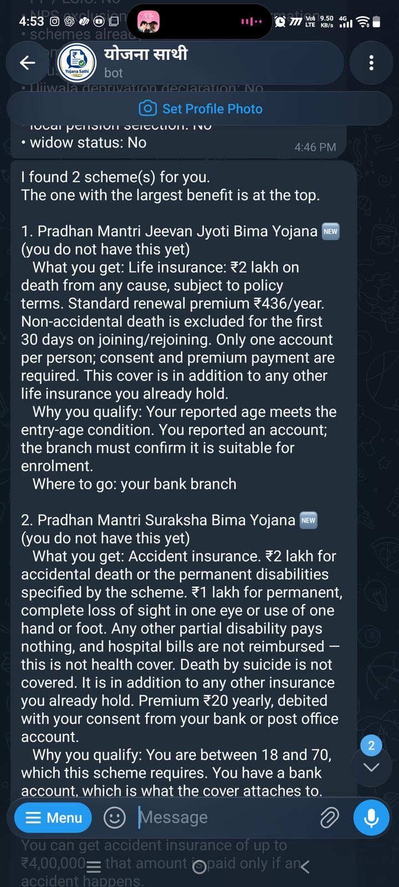
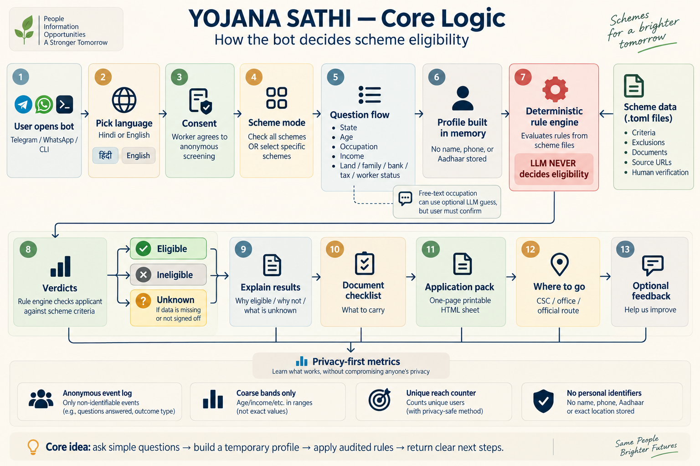

<p align="center">
  
</p>

<h1 align="center">Yojana Sathi</h1>

<h3 align="center">Know before you go.</h3>

<p align="center">
  A Hindi and English conversation that tells an unorganised worker<br>
  which government schemes fit, what each is worth in ₹, and where to go to claim it.
</p>

<p align="center">
  <a href="https://sathi.avinashnegi.com"><b>Try it in your browser</b></a>
  &nbsp;&nbsp;·&nbsp;&nbsp;
  <a href="https://t.me/YojanaSathiBot">Open on Telegram ›</a>
  &nbsp;&nbsp;·&nbsp;&nbsp;
  <a href="https://avinashnegi.com/yojana-sathi/">See the project ›</a>
</p>

<br>

<p align="center">
  
</p>

<p align="center"><sub>Code for a Billion 2026 · Livelihood for the Uneducated · Apache-2.0</sub></p>

<br>

## One wrong trip costs a day's wage.

The schemes already exist. What a worker can't tell from outside is whether one will accept them.

| | |
|---|---|
| **43.99 crore** | people in India's unorganised sector, 2019–20[^1] |
| **31.48 crore** | registered on e-Shram, with 14 central schemes mapped to it[^2] |
| **₹455 · ₹315** | a day, average earnings of a male · female casual labourer, 2025[^3] |

A failed trip to a Common Service Centre costs that day's wage. Often, there is no second trip.

<br>

## Not another myScheme. The last mile after it.

myScheme and UMANG publish the schemes and match eligibility. myScheme is a form — available in Hindi, but still a form. It assumes literacy, a browser, and someone who knows what "land holding in hectares" means.

Yojana Sathi is a conversation on a ₹6,000 phone that ends in a checklist and an address.

<br>

## How it works.

1. **Choose.** Every signed scheme, or just the ones you care about.
2. **Answer.** Only the questions those schemes need. Buttons for everything except age. "Don't know" is always allowed.
3. **Decide.** Plain rule files with cited sources. Same answers, same verdict.
4. **Walk in.** What you get, what it costs, what to carry, where to go — and a one-page sheet to show at the centre.

<p align="center">
  
</p>

<p align="center"><sub>Every module and what it calls: <a href="livesite/assets/system-architecture.png">code map</a> · <a href="docs/ARCHITECTURE.md">architecture notes</a></sub></p>

<br>

## The rules decide. A model never does.

- **Rules are plain text.** One TOML file per scheme in [`data/schemes/`](data/schemes/), readable without knowing Python.
- **Every value is cited.** Each links to the official page it came from, with the date it was checked.
- **Gaps stay gaps.** An unresearched value is the string `"TODO"`, never `0`, and the engine answers `UNKNOWN` instead of guessing.
- **Three verdicts.** `ELIGIBLE`, `INELIGIBLE`, `UNKNOWN`. Unknown says what's missing and what to ask at the centre.
- **The model is optional.** It may suggest an occupation for the worker to confirm. No signed scheme asks occupation, so in normal use it is never called. It never sees a threshold, a ₹ figure or a verdict.
- **No key, same answers.** With `LLM_API_KEY` unset, everything runs on buttons with identical results. That is tested, not degraded.
- **Hindi and English agree.** Only the words change. A test asserts the verdicts are identical.

<br>

## Ten schemes. Each signed by a person.

| Scheme | Stated benefit | Where to apply |
|---|---|---|
| PM Shram Yogi Maandhan | ₹36,000 a year from age 60 | Common Service Centre |
| National Pension Scheme for Traders | ₹36,000 a year from age 60 | Common Service Centre |
| Uttarakhand old-age pension | ₹18,000 a year | State portal |
| Indira Gandhi National Old Age Pension | ₹2,400 a year central share; ₹6,000 from 80 | Common Service Centre |
| Indira Gandhi National Widow Pension | ₹3,600 a year central share; ₹6,000 from 80 | Common Service Centre |
| Indira Gandhi National Disability Pension | ₹3,600 a year central share; ₹6,000 from 80 | Common Service Centre |
| PM Jeevan Jyoti Bima Yojana | ₹2,00,000 life cover | Bank branch |
| PM Suraksha Bima Yojana | ₹2,00,000 accident cover | Bank branch |
| PM Ujjwala Yojana | In-kind LPG support | Online or an LPG distributor |
| e-Shram registration | Gateway — no payout of its own | e-Shram portal or a CSC |

- **The signature is enforced.** Until a named person signs a file, every worker gets `UNKNOWN` for it and it adds ₹0 to every total. [`tests/test_schemes.py`](tests/test_schemes.py) pins the signed list.
- **Five drafts are not served:** APY, PM Vishwakarma, PM-JAY 70+, PMJDY and the Uttarakhand widow pension. The widow pension's signature was withdrawn on 15 September; its department page states no rate. [Why](data/schemes/uk_widow.toml).
- **Overlapping pensions are never added.** Two routes to the same pension show the larger, once.

What could and could not be verified: [`docs/history/SOURCE_REVIEW_2026-09-09.md`](docs/history/SOURCE_REVIEW_2026-09-09.md).

<br>

## Where it runs.

| | |
|---|---|
| **Browser** | Live at [sathi.avinashnegi.com](https://sathi.avinashnegi.com). No account, no app. |
| **Telegram** | Live at [@YojanaSathiBot](https://t.me/YojanaSathiBot). |
| **WhatsApp** | Built and verified end to end on Meta's test number. Not on a public number yet. |

One small AWS server, one rule engine behind all three. The landing page is [`livesite/`](livesite/), published by GitHub Pages.

<br>

## Impact. None claimed yet.

<!-- ! Populated from real deployment data only, by
     ! `python3 -m sathi.metrics.report`. No projections, no estimates, no
     ! "potential reach". If a number is not in the event log it does not go on
     ! this page. -->

No field pilot has run, so there are no impact numbers here. This section is filled from the event log after a real pilot — never from an estimate or a "potential reach".

- **Pilot screenings are counted apart.** They arrive through `?start=csc` links and are reported with `python3 -m sathi.metrics.report --cohort csc`. Terminal test runs are left out by default.
- **Two ₹ figures, never one.** A yearly pension and an insurance cover are different kinds of money. Adding them would overstate what a worker receives about six times.
- **"Entitlement surfaced", never "money delivered".** A figure is what a scheme states it pays, not what anyone has received.
- **Browser sessions are not counted as people.** A cookie is a routing key, not an identity.

The pilot plan: [`docs/PILOT_PLAN.md`](docs/PILOT_PLAN.md). What each number does not claim: [`docs/IMPACT.md`](docs/IMPACT.md).

<br>

## Private by design.

- **No name, phone or Aadhaar field exists**, so none can be stored by accident.
- **The profile lives in memory for one session.** It is gone when the screening ends, on `/cancel`, or after 30 quiet minutes.
- **The log keeps coarse bands only** — state, age band, income band, rarely occupation — plus the channel and, after consent, the arrival link's tag. All under a random session id that is not derived from any account. On the dashboard, breakdown rows under 5 sessions are hidden.
- **The optional suggestion** is stored with digit runs removed, and with no session id.

[`tests/test_privacy.py`](tests/test_privacy.py) drives every event through the log and checks what survived, column by column.

<br>

## Run it yourself.

```bash
git clone https://github.com/avinashnegi1999/yojana-sathi && cd yojana-sathi

python3 check.py              # every check and test
python3 -m sathi.local_web    # the browser version on http://127.0.0.1:8765
python3 -m sathi.main         # one screening in the terminal
```

Python 3.11 or newer. **Zero third-party dependencies** — not in the app, not in the tests.

<details>
<summary><b>More ways to run it</b></summary>

<br>

```bash
python3 -m sathi.main --telegram            # the bot (needs TELEGRAM_TOKEN)
python3 -m sathi.main --whatsapp            # the webhook (needs WHATSAPP_*, behind TLS)
python3 -m sathi.main --preview whatsapp    # what the wire would carry; nothing is sent
python3 -m sathi.metrics.report --out impact.html                              # impact dashboard (reads DB_PATH)
python3 -m sathi.metrics.report --cohort csc --since 2026-10-01 --out pilot.html   # pilot only
```

As a container:

```bash
docker build -t scheme-sathi .
docker run -e TELEGRAM_TOKEN=... -v sathi-data:/data scheme-sathi
```

`DB_PATH` must point at a mounted volume. A container that loses its disk loses the event log, and every impact number with it.

Optional settings, all off by default and all tested off:

| Variable | When set |
|---|---|
| `LLM_API_KEY` | Free-text occupation is mapped to a category, always confirmed by the worker. Verdicts are unchanged. |
| `TTS_CMD` | **Not wired yet.** No channel sends audio; setting it only changes the startup line. |
| `FOLLOWUP_SALT` | Records opt-ins for a 14-day follow-up as a salted hash. **The sender is not built.** Leave unset. |

Deploying: [`deploy/RUNBOOK.md`](deploy/RUNBOOK.md).

</details>

<details>
<summary><b>Bot commands</b></summary>

<br>

| Command | What it does |
|---|---|
| `/start` | Begin, or start over |
| `/language` | Switch हिंदी ↔ English, keeping answers already given |
| `/schemes` | Every scheme, its official source, and when it was checked |
| `/privacy` | What is stored, what is never asked |
| `/about` | What this is — and that it is not a government service |
| `/help` | The command list |
| `/clear` | Delete this conversation's messages |
| `/clearall` | Delete everything reachable from the last 48 hours |
| `/cancel` | Drop the profile now and end |
| `/demo` | Fictional people run through the real rules. Labelled a demo, logs nothing. |

</details>

<br>

## Tested like it matters.

`python3 check.py` runs 21 module self-checks and 15 test files. No framework, nothing to install.

- **Every button.** [`tests/test_all_paths.py`](tests/test_all_paths.py) presses every button at every screen in both languages — 9,860 paths — and opens every sheet it produces.
- **Every boundary.** [`tests/test_rule_boundaries.py`](tests/test_rule_boundaries.py) re-encodes each rule from the official text and compares 1,377,810 verdicts, plus 22,248 combinations of each signed scheme's own fields. It proves two encodings agree, not that either matches the law. The signature covers that.
- **Every column.** [`tests/test_privacy.py`](tests/test_privacy.py), above.

<br>

## Rules stay honest after they are written.

```bash
python3 -m sathi.review PMJJBY    # sign a scheme off, value by value
python3 -m sathi.sources          # has a ministry changed a number?
```

**Review** shows every value beside the page it came from, then writes exactly two lines. A signature can never carry a changed threshold in with it. `--unsign` reverses it.

**Sources** re-reads the official pages on demand and flags what changed. The three national pension pages can't be watched this way and need a monthly re-read by hand — [the list](data/sources/official-text/README.md).

<br>

## How it was built.

- [The build story](https://avinashnegi.com/blog/scheme-sathi/) — built with AI, checked by hand.
- [`docs/README.md`](docs/README.md) — which documents are current. Start here before quoting any.
- [`docs/LESSONS.md`](docs/LESSONS.md) — ten lessons, including the ones that cost something.
- [`docs/history/BUILD_LOG.md`](docs/history/BUILD_LOG.md) — every bug, every number that turned out wrong.
- [`AUDIT.md`](AUDIT.md) — the latest audit, and what was fixed.

<br>

## Add a scheme.

No Python needed. Copy [`data/schemes/_TEMPLATE.toml`](data/schemes/_TEMPLATE.toml), fill it from official sources, and cite every value — see [`docs/SCHEME_AUTHORING.md`](docs/SCHEME_AUTHORING.md).

Values without a `source_url` and `verified_on` are not merged. An uncited threshold looks exactly like a guessed one, and a guess costs a worker a day's wage.

<br>

---

<p align="center"><sub>
  Apache-2.0 · <a href="LICENSE">Licence</a><br>
  Built for Code for a Billion — Bharat Agentic-AI Hackathon 2026 (Code for India), track "Livelihood for the Uneducated".<br>
  Independent project. Not a government service.
</sub></p>

[^1]: Ministry of Labour & Employment, Lok Sabha written reply, 24 July 2023, citing the Economic Survey 2021-22. <https://www.pib.gov.in/PressReleasePage.aspx?PRID=1942079>

[^2]: Ministry of Labour & Employment, *e-Shram Cards for Unorganized Workers*, 2 February 2026 — registrations as on 26 January 2026. <https://www.pib.gov.in/PressReleasePage.aspx?PRID=2222263&reg=3&lang=2>

[^3]: National Statistical Office, MoSPI, *Press Note on Periodic Labour Force Survey Annual Report, 2025*, section 6 — casual labour other than public works. <https://www.mospi.gov.in/uploads/latestReleases/latest_release_1774607827733_3e8964a9-268b-4cc9-ad65-cfc8a9e32f08_Press_note_AR_PLFS_2025_23032025_V2.1_26032026_final.pdf>
