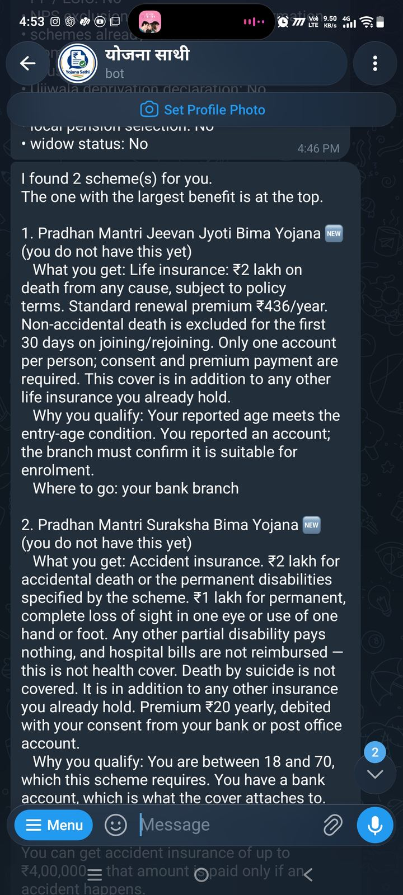
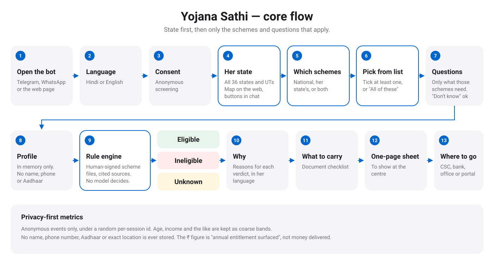

<p align="center">
  
</p>

<h1 align="center">Yojana Sathi</h1>

<h3 align="center">Know before you go.</h3>

<p align="center">
  A Hindi and English chat that tells an unorganised worker<br>
  which government schemes fit, what each is worth in ₹, and where to go.
</p>

<p align="center">
  <a href="https://sathi.avinashnegi.com"><b>Try it in your browser</b></a>
  &nbsp;&nbsp;·&nbsp;&nbsp;
  <a href="https://t.me/YojanaSathiBot">Open on Telegram ›</a>
  &nbsp;&nbsp;·&nbsp;&nbsp;
  <a href="https://avinashnegi.com/yojana-sathi/#film">Watch the film ›</a>
  &nbsp;&nbsp;·&nbsp;&nbsp;
  <a href="https://avinashnegi.com/yojana-sathi/">See the project ›</a>
</p>

<br>

<p align="center">
  
</p>

<p align="center"><sub>Code for a Billion 2026 · Livelihood for the Uneducated · Apache-2.0</sub></p>

<br>

## One wrong trip costs a day's wage.

The schemes exist. What a worker can't tell from outside is whether one will accept them.

| | |
|---|---|
| **43.99 crore** | people in India's unorganised sector, 2019–20[^1] |
| **31.48 crore** | registered on e-Shram, with 14 central schemes mapped to it[^2] |
| **₹455 · ₹315** | a day, average earnings of a male · female casual labourer, 2025[^3] |

A wasted trip to a Common Service Centre costs that day's wage. Often there is no second trip.

<br>

## Not another myScheme. The last mile after it.

myScheme is a form. It assumes literacy, a browser, and knowing what "land holding in hectares" means.

Yojana Sathi is a chat on a ₹6,000 phone that ends in a checklist and an address.

<br>

## How it works.

1. **Where.** Your state first — any of 36, on a map in the browser or buttons in chat.
2. **Choose.** National schemes, your state's, or both. Tick some, or "All of these".
3. **Answer.** Only what those schemes need. "Don't know" is always allowed.
4. **Decide.** Plain rule files with cited sources. Same answers, same verdict.
5. **Walk in.** What you get, what it costs, what to carry, where to go — and a one-page sheet.

<p align="center">
  
</p>

<p align="center"><sub><a href="livesite/assets/system-architecture.png">Code map</a> · <a href="docs/ARCHITECTURE.md">Architecture notes</a></sub></p>

<br>

## The rules decide. A model never does.

- **Rules are plain text.** One TOML file per scheme in [`data/schemes/`](data/schemes/).
- **Every value is cited** — the official page, and the date it was checked.
- **Gaps stay gaps.** An unresearched value is `"TODO"`, never `0`. The answer is `UNKNOWN`, not a guess.
- **Three verdicts.** `ELIGIBLE`, `INELIGIBLE`, `UNKNOWN`. Unknown says what's missing and what to ask.
- **The model is optional.** It may suggest an occupation for the worker to confirm. It never sees a threshold, a ₹ figure or a verdict.
- **No key, same answers.** Without `LLM_API_KEY` everything runs on buttons, with identical results. Tested.
- **Hindi and English agree.** Only the words change. A test holds the verdicts identical.

<br>

## Twenty-one schemes. Each signed by a person.

**National — every state (13)**

| Scheme | Stated benefit | Where |
|---|---|---|
| PM Shram Yogi Maandhan | ₹36,000 a year from 60 | CSC |
| National Pension Scheme for Traders | ₹36,000 a year from 60 | CSC |
| Atal Pension Yojana | From ₹12,000 a year at 60 | Bank |
| Indira Gandhi National Old Age Pension | ₹2,400 a year (central share); ₹6,000 from 80 | CSC |
| Indira Gandhi National Widow Pension | ₹3,600 a year (central share); ₹6,000 from 80 | CSC |
| Indira Gandhi National Disability Pension | ₹3,600 a year (central share); ₹6,000 from 80 | CSC |
| PM Jeevan Jyoti Bima Yojana | ₹2,00,000 life cover | Bank |
| PM Suraksha Bima Yojana | ₹2,00,000 accident cover | Bank |
| Ayushman Bharat PM-JAY, 70+ | ₹5,00,000 hospital cover a year | Ayushman app or hospital |
| PM Vishwakarma | Toolkit up to ₹15,000; ₹500 a day in training | CSC |
| PM Ujjwala Yojana | LPG connection | Online or LPG distributor |
| Jan Dhan account (PMJDY) | Free account, RuPay card | Bank or Bank Mitra |
| e-Shram registration | Gateway to other schemes | e-Shram portal or CSC |

**State pensions — shown only in that state (8)**

| Scheme | Stated benefit | Where |
|---|---|---|
| Uttarakhand old-age / widow | ₹18,000 a year each | State portal |
| Sikkim old-age | ₹18,000 a year; ₹24,000 from 70; ₹30,000 from 80 | State portal |
| Sikkim widow / disability | ₹24,000 a year each | State portal |
| Madhya Pradesh Kalyani (widows 18–79) | ₹7,200 a year | Panchayat or municipal office |
| Punjab old-age (women 58+, men 65+) | ₹18,000 a year | Panchayat, block or municipal office |

- **Never added twice.** A state pension replaces the national central share. Two routes to one pension show the larger, once.
- **The signature is enforced.** An unsigned file answers `UNKNOWN` and adds ₹0. [`tests/test_schemes.py`](tests/test_schemes.py) pins the signed list.
- **Not served:** Tamil Nadu and Mizoram drafts — no official page lists their documents.

Evidence for every value, with SHA-256: [`docs/audit-evidence/`](docs/audit-evidence/README.md). Research on all 36 states: [`docs/research/states/`](docs/research/states/README.md).

<br>

## Where it runs.

| | |
|---|---|
| **Browser** | [sathi.avinashnegi.com](https://sathi.avinashnegi.com). No account, no app. |
| **Telegram** | [@YojanaSathiBot](https://t.me/YojanaSathiBot). |
| **WhatsApp** | Verified end to end on Meta's test number. Not public yet. |

One small AWS server, one rule engine behind all three. The landing page is [`livesite/`](livesite/), on GitHub Pages.

<br>

## Impact. None claimed yet.

<!-- ! Populated from real deployment data only, by
     ! `python3 -m sathi.metrics.report`. No projections, no estimates, no
     ! "potential reach". If a number is not in the event log it does not go on
     ! this page. -->

No field pilot has run, so there are no numbers here. They come from the event log after a real pilot — never from an estimate.

- **Pilot screenings are counted apart** — `?start=csc` links, reported with `python3 -m sathi.metrics.report --cohort csc`.
- **Two ₹ figures, never one.** A pension and an insurance cover are different money. Adding them would overstate about six times.
- **"Entitlement surfaced", never "money delivered".**
- **A browser session is not a person.** A cookie is a routing key, not an identity.

[Pilot plan](docs/PILOT_PLAN.md) · [What each number does not claim](docs/IMPACT.md)

<br>

## Private by design.

- **No name, phone or Aadhaar field exists**, so none can be stored.
- **The profile lives in memory for one session** — gone at the end, on `/cancel`, or after 30 quiet minutes.
- **The log keeps coarse bands only**, under a random session id not derived from any account. Dashboard rows under 5 sessions are hidden.
- **The optional suggestion** is stored with digit runs removed, and with no session id.

[`tests/test_privacy.py`](tests/test_privacy.py) checks what reaches the log, column by column.

<br>

## Run it yourself.

```bash
git clone https://github.com/avinashnegi1999/yojana-sathi && cd yojana-sathi

python3 check.py              # every check and test
python3 -m sathi.local_web    # the browser version on http://127.0.0.1:8765
python3 -m sathi.main         # one screening in the terminal
```

Python 3.11+. **Zero third-party dependencies.**

<details>
<summary><b>More ways to run it</b></summary>

<br>

```bash
python3 -m sathi.main --telegram            # the bot (needs TELEGRAM_TOKEN)
python3 -m sathi.main --whatsapp            # the webhook (needs WHATSAPP_*, behind TLS)
python3 -m sathi.main --preview whatsapp    # what the wire would carry; nothing is sent
python3 -m sathi.metrics.report --out impact.html                                  # impact dashboard
python3 -m sathi.metrics.report --cohort csc --since 2026-10-01 --out pilot.html   # pilot only
```

As a container — `DB_PATH` must be on a mounted volume, or the event log is lost:

```bash
docker build -t scheme-sathi .
docker run -e TELEGRAM_TOKEN=... -v sathi-data:/data scheme-sathi
```

Optional, off by default, tested off:

| Variable | When set |
|---|---|
| `LLM_API_KEY` | Free-text occupation mapped to a category, always confirmed. Verdicts unchanged. |
| `TTS_CMD` | **Not wired yet.** No channel sends audio. |
| `FOLLOWUP_SALT` | Records 14-day follow-up opt-ins as a salted hash. **No sender yet.** Leave unset. |

Deploying: [`deploy/RUNBOOK.md`](deploy/RUNBOOK.md).

</details>

<details>
<summary><b>Bot commands</b></summary>

<br>

| Command | What it does |
|---|---|
| `/start` | Begin, or start over |
| `/language` | Switch हिंदी ↔ English, keeping answers |
| `/schemes` | Every scheme, its source, when it was checked |
| `/privacy` | What is kept, what is never asked |
| `/about` | What this is — not a government service |
| `/help` | The command list |
| `/clear` · `/clearall` | Delete this chat's messages · everything from 48 hours |
| `/cancel` | Drop the profile and end |
| `/demo` | Fictional people through the real rules. Logs nothing. |

</details>

<br>

## Tested like it matters.

`python3 check.py` — 21 module self-checks and 15 test files. No framework.

- **Every button.** [`tests/test_all_paths.py`](tests/test_all_paths.py) presses every button on every screen in both languages — 9,840 paths — and opens every sheet.
- **Every boundary.** [`tests/test_rule_boundaries.py`](tests/test_rule_boundaries.py) re-encodes each rule from the official text and checks 3,168,963 verdicts, plus 371,283 for each signed scheme's own fields. It proves two encodings agree; the signature covers the law.
- **Every column.** [`tests/test_privacy.py`](tests/test_privacy.py).

<br>

## Rules stay honest after they are written.

```bash
python3 -m sathi.review PMJJBY    # sign a scheme off, value by value
python3 -m sathi.sources          # has a ministry changed a number?
```

**Review** shows every value beside its source, then writes two lines. A signature can't carry a changed threshold in with it. `--unsign` reverses it.

**Sources** re-reads the official pages and flags changes. Three national pension pages need a monthly read by hand — [the list](data/sources/official-text/README.md).

<br>

## How it was built.

- [The build story](https://avinashnegi.com/blog/scheme-sathi/) — built with AI, checked by hand.
- [`docs/README.md`](docs/README.md) — which documents are current.
- [`docs/LESSONS.md`](docs/LESSONS.md) — ten lessons, including the costly ones.
- [`docs/history/BUILD_LOG.md`](docs/history/BUILD_LOG.md) — every bug, every number that turned out wrong.
- [`AUDIT.md`](AUDIT.md) — the latest audit, and what was fixed.

<br>

## Add a scheme.

No Python needed. Copy [`data/schemes/_TEMPLATE.toml`](data/schemes/_TEMPLATE.toml), fill it from official sources, cite every value — see [`docs/SCHEME_AUTHORING.md`](docs/SCHEME_AUTHORING.md).

A value without `source_url` and `verified_on` is not merged. An uncited threshold looks exactly like a guess.

<br>

---

<p align="center"><sub>
  Apache-2.0 · <a href="LICENSE">Licence</a><br>
  Built for Code for a Billion — Bharat Agentic-AI Hackathon 2026 (Code for India), track "Livelihood for the Uneducated".<br>
  Independent project. Not a government service.
</sub></p>

[^1]: Ministry of Labour & Employment, Lok Sabha written reply, 24 July 2023, citing the Economic Survey 2021-22. <https://www.pib.gov.in/PressReleasePage.aspx?PRID=1942079>

[^2]: Ministry of Labour & Employment, *e-Shram Cards for Unorganized Workers*, 2 February 2026 — registrations as on 26 January 2026. <https://www.pib.gov.in/PressReleasePage.aspx?PRID=2222263&reg=3&lang=2>

[^3]: National Statistical Office, MoSPI, *Press Note on Periodic Labour Force Survey Annual Report, 2025*, section 6 — casual labour other than public works. <https://www.mospi.gov.in/uploads/latestReleases/latest_release_1774607827733_3e8964a9-268b-4cc9-ad65-cfc8a9e32f08_Press_note_AR_PLFS_2025_23032025_V2.1_26032026_final.pdf>
